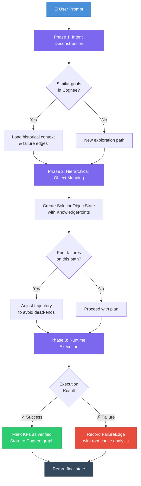
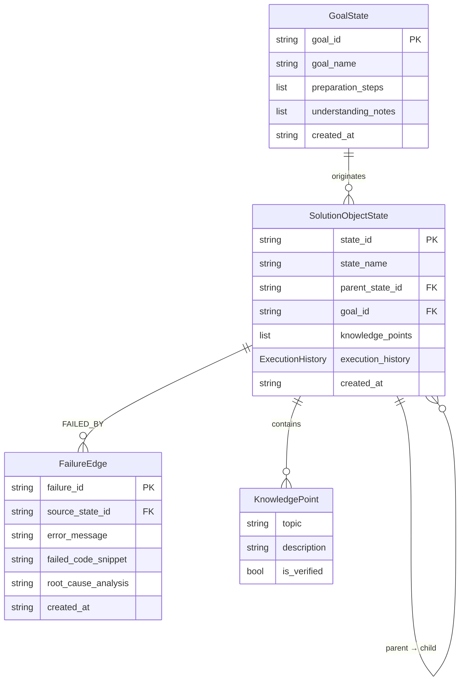

<p align="center">
  <h1 align="center">🧠 State-Driven Developer Agent</h1>
  <p align="center">
    <strong>A persistent-memory AI agent that never repeats the same mistake twice.</strong>
  </p>
  <p align="center">
    Built with <a href="https://github.com/topoteretes/cognee">Cognee</a> Knowledge Graphs &bull; Powered by LLM Inference &bull; Deterministic 3-Phase Cognitive Loop
  </p>
  <p align="center">
    
    
    
    
  </p>
</p>

---

## The Problem

Traditional LLM agents are **stateless**. They forget everything between sessions — including their own failures. Ask the same broken question twice, and you'll get the same broken answer twice. There is no learning, no adaptation, and no persistent memory of what worked.

## The Solution

**State-Driven Developer Agent** solves this by treating every interaction as a node in a persistent knowledge graph. Goals, solution strategies, and failures are permanently recorded using [Cognee](https://github.com/topoteretes/cognee), creating an ever-growing web of structured experience that the agent queries *before* attempting any new task.

> The agent doesn't just answer — it **remembers**, **reasons over history**, and **avoids known dead-ends**.

---

## Architecture



---

## Key Features

| Feature | Description |
|---------|-------------|
| **🔄 3-Phase Cognitive Loop** | Every prompt flows through Intent Deconstruction → Object Mapping → Runtime Execution |
| **🧠 Persistent Memory** | Goals, solutions, and failures stored permanently in a Cognee knowledge graph |
| **🚫 Dead-End Prevention** | `FailureEdge` records prevent the agent from re-traversing paths that previously failed |
| **📊 Structured State Machine** | Pydantic-enforced schemas (`GoalState`, `SolutionObjectState`, `FailureEdge`) — no loose JSON |
| **🔌 Provider Agnostic** | Swap between Ollama (local), Gemini, OpenAI, or any LiteLLM-supported provider via `.env` |
| **🏗️ Hierarchical Solutions** | Solution nodes form parent-child trees with inherited constraints |
| **📝 Root Cause Analysis** | Failed executions are automatically analyzed by the LLM before being stored |

---

## How It Works

### Phase 1 — Intent Deconstruction & Goal Serialization

The LLM parses your natural language prompt into a typed `GoalState` with a goal name, preparation steps, and understanding notes. Cognee is then queried for **similar historical goals** — if a match is found, the agent loads lessons from past attempts before proceeding.

### Phase 2 — Hierarchical Object Mapping

A `SolutionObjectState` is created with discrete `KnowledgePoint` nodes representing facts, invariants, or system constraints. The agent checks the graph for **ancestor constraints** (parent solution nodes) and **prior failure records** on similar paths, adjusting its strategy accordingly.

### Phase 3 — Runtime Execution & Failure Recording

If the solution includes an executable plan, the agent runs it in a sandboxed subprocess with timeout protection. On success, knowledge points are marked as **verified**. On failure, a `FailureEdge` is created with:
- The exact error message
- The code that caused the failure
- An LLM-generated root cause analysis

This edge is **permanently stored**, ensuring the agent will never attempt the same broken approach again.

---

## Quick Start

### Prerequisites

- **Python 3.10+**
- **Ollama** (for local embeddings) — [Install Ollama](https://ollama.ai)
- An LLM provider API key (Gemini, OpenAI, or local Ollama)

### Installation

```bash
# Clone the repository
git clone https://github.com/Sanhik-2/HangoverPartAI.git
cd HangoverPartAI

# Create and activate virtual environment
python -m venv .venv
source .venv/bin/activate  # Linux/macOS
# .venv\Scripts\activate   # Windows

# Install dependencies
pip install "cognee[ollama]"

# Pull the embedding model
ollama pull nomic-embed-text
```

### Configuration

Copy and configure the environment file:

```bash
cp .env.example .env
```

Edit `.env` with your preferred LLM provider:

```env
# ── Cloud LLM (Gemini via OpenAI gateway) ──
LLM_PROVIDER="openai"
LLM_MODEL="openai/gemini-2.5-flash"
LLM_API_KEY="your-api-key-here"
LLM_ENDPOINT="https://generativelanguage.googleapis.com/v1beta/openai/"

# ── OR Local LLM (Ollama) ──
# LLM_PROVIDER="ollama"
# LLM_MODEL="qwen2.5:3b"
# LLM_ENDPOINT="http://localhost:11434/v1"

# ── Local Embeddings (Ollama) ──
EMBEDDING_PROVIDER="ollama"
EMBEDDING_MODEL="ollama/nomic-embed-text"
EMBEDDING_ENDPOINT="http://localhost:11434"
EMBEDDING_DIMENSIONS=768
```

### Run

```bash
# Start the interactive agent REPL
python main.py
```

---

## Usage

```
╔══════════════════════════════════════════════════════════════╗
║   State-Driven Developer Agent                               ║
║   Cognee Knowledge Graph + LLM                               ║
║                                                              ║
║   Commands:                                                  ║
║     /reset   — Wipe all memory and start fresh               ║
║     /status  — Show current LLM & Cognee status              ║
║     /verbose — Toggle verbose logging                        ║
║     /quit    — Exit the agent                                ║
╚══════════════════════════════════════════════════════════════╝

  agent> Write a Python function to merge two sorted arrays

  ━━━━━━━━━━━━━━━━━━━━━━━━━━━━━━━━━━━━━━━━━━━━━━━━━━━━━━━━━━━━
  Processing: Write a Python function to merge two sorted arrays
  ━━━━━━━━━━━━━━━━━━━━━━━━━━━━━━━━━━━━━━━━━━━━━━━━━━━━━━━━━━━━

  ══ Phase 1: Intent Deconstruction ══
    Goal created: Merge sorted arrays function (goal_a1b2c3d4e5f6)
    No similar historical goals found — new exploration path.

  ══ Phase 2: Hierarchical Object Mapping ══
    Solution state: Two-pointer merge implementation (state_f6e5d4c3b2a1)
    Knowledge points: 3

  ══ Phase 3: Runtime Execution ══
    ✓ Execution succeeded.

  ──────────────────────────────────────────────────────
  ✓ Status: SUCCESS
  Goal:   Merge sorted arrays function
  State:  Two-pointer merge implementation
  KPs:    3 knowledge point(s)
  ──────────────────────────────────────────────────────
```

---

## Project Structure

```
CogneeAIProject/
├── main.py                     # CLI REPL entry point
├── agent_loop.py               # 3-phase cognitive loop engine
├── cognee_memory.py            # Cognee knowledge graph wrapper
├── state_schemas.py            # Pydantic models (GoalState, SolutionObjectState, etc.)
├── test_cognee_integration.py  # Unit + integration test suite
├── .env                        # Environment configuration
├── requirements.txt            # Pinned dependencies
└── .cognee_system/             # Local Cognee database files (auto-generated)
```

### Module Responsibilities

| Module | Role |
|--------|------|
| `main.py` | Interactive REPL, Ollama connectivity checks, command handling |
| `agent_loop.py` | LLM interface, 3-phase loop orchestration, failure analysis |
| `cognee_memory.py` | Async Cognee wrapper — `store_goal()`, `store_state()`, `record_failure()`, similarity search |
| `state_schemas.py` | Pydantic schemas enforcing typed JSON structure for all graph nodes |

---

## Data Model



---

## Testing

```bash
# Run unit tests (no external services needed)
python test_cognee_integration.py

# Run full integration tests (requires Ollama + LLM provider)
python test_cognee_integration.py --integration
```

### Test Coverage

| Suite | Tests | Requires |
|-------|-------|----------|
| Schema Serialization | 4 tests — GoalState, SolutionObjectState, FailureEdge, ExecutionHistory | Nothing |
| Module Imports | 1 test — validates all modules load cleanly | `cognee` installed |
| Cognee Pipeline | 3 tests — goal lifecycle, state lifecycle, failure recording | Ollama + LLM running |

---

## Tech Stack

| Component | Technology |
|-----------|------------|
| **Knowledge Graph** | [Cognee](https://github.com/topoteretes/cognee) v1.2.1 (NetworkX + LanceDB) |
| **LLM Routing** | [LiteLLM](https://github.com/BerriAI/litellm) v1.83.7 |
| **Schema Validation** | [Pydantic](https://docs.pydantic.dev/) v2.12.5 |
| **Embeddings** | Ollama `nomic-embed-text` (768 dimensions, runs locally) |
| **LLM Providers** | Gemini, OpenAI, Ollama — any LiteLLM-supported model |
| **Runtime** | Python 3.10+ with async/await |

---

## Configuration Reference

| Variable | Default | Description |
|----------|---------|-------------|
| `LLM_PROVIDER` | `ollama` | LLM provider (`ollama`, `openai`) |
| `LLM_MODEL` | `qwen2.5:3b` | Model identifier |
| `LLM_API_KEY` | — | API key for cloud providers |
| `LLM_ENDPOINT` | `http://localhost:11434/v1` | LLM API endpoint |
| `EMBEDDING_PROVIDER` | `ollama` | Embedding provider |
| `EMBEDDING_MODEL` | `ollama/nomic-embed-text` | Embedding model |
| `EMBEDDING_ENDPOINT` | `http://localhost:11434` | Embedding API endpoint |
| `EMBEDDING_DIMENSIONS` | `768` | Embedding vector dimensions |
| `COGNEE_SYSTEM_PATH` | `~/.cognee` | Local database storage path |
| `ENABLE_BACKEND_ACCESS_CONTROL` | `false` | Cognee multi-tenant auth |

---

## Contributing

1. Fork the repository
2. Create a feature branch (`git checkout -b feature/your-feature`)
3. Run the test suite (`python test_cognee_integration.py`)
4. Commit your changes (`git commit -m 'Add your feature'`)
5. Push to the branch (`git push origin feature/your-feature`)
6. Open a Pull Request

---

## License

This project is licensed under the MIT License — see the [LICENSE](LICENSE) file for details.

---

<p align="center">
  Built for the <strong>Cognee Hackathon</strong> 🏆
</p>
